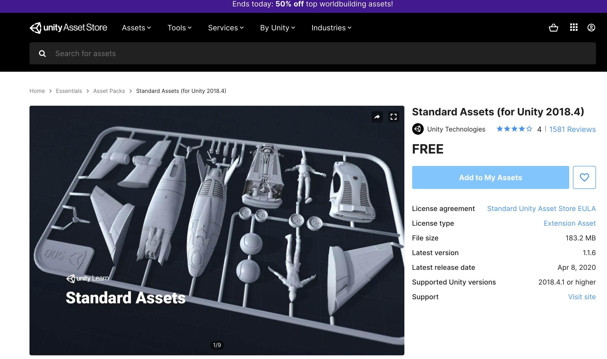
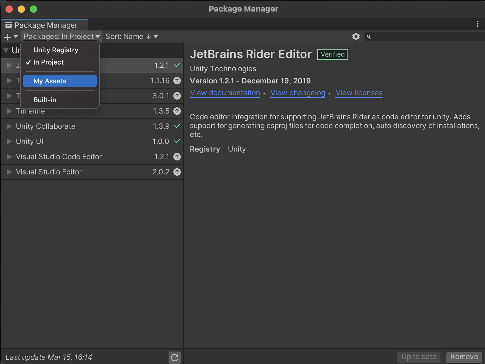
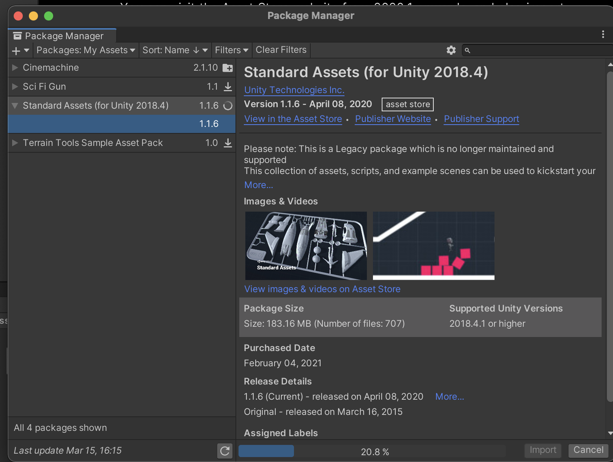
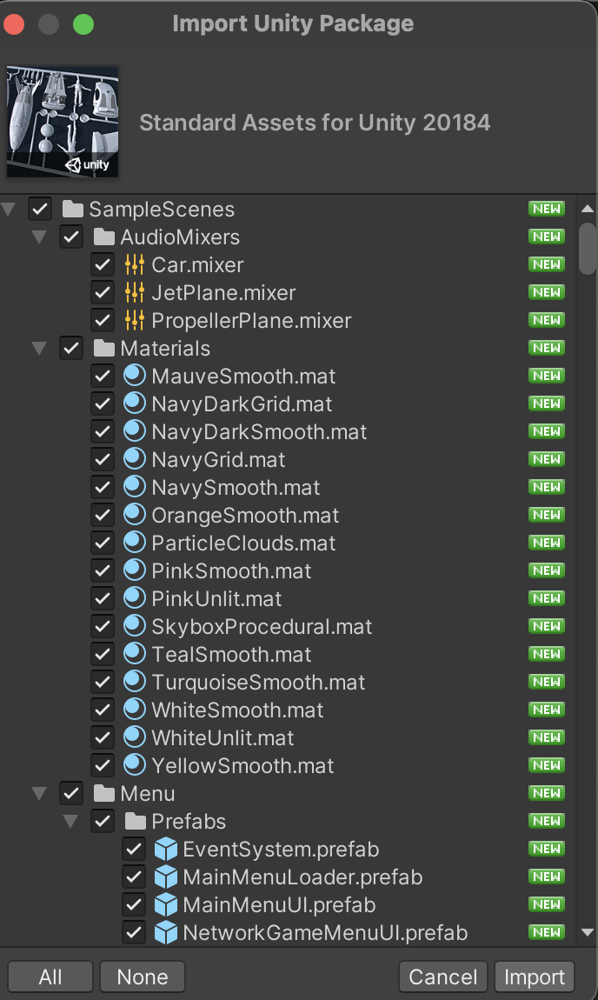

# Instalar Standard Assets para proyecto

## Habilitar el asset desde el Unity Asset Store.

Demtro de Unity ir al siguiente menú: Window -> Asset Store

Luego seleccionar la opción de Búsqueda Online (Search Online), lo que le abrirá un navegador. En el navegador escribir Standard Assets y seleccionar el item que corresponda.

Luego Se le mostrará una imagen como la que sigue:

Luego deberá hacer click en el botón "Add to My Assets" para agregar el paquete dentro de los assets que se podrán descargar en Unity.

## Descarga e importación en el proyecto de Standard Assets

Posteriormente dentro de Unity, seleccionar la opción del menú Window->Package Manager  donde le abrirá una ventana modal. En esa ventana, en el combo que dice Packages: In Project hacer click y seleccionar la opción "My Assets" como el gráfico.

En caso que sea la primera vez que descarga el paquete, deberá de  seleccionar el item Standard Assets y en la parte inferior derecha hacer click en el botón "Download". Esto descargará el paquete.

Cuando termine la descarga (o si ya se encontraba descargado) hagamos clicjk en el botón "Import" que abrirá una pantalla como la que sigue:"

Acá solamente volveremos a hacer click en el botón Import para ya agregar el paquete completo al proyecto.

El problema de este paquete de Standard Assets es que tiene algunos problemas con versiones de Unity mayores a las del 2018, por lo que para corregirlo se tiene que instalar un fix.

## Instalar parche de Standard Assets

Descargar el siguiente parche:

- [Descargar parche](https://github.com/ulima-pv/taller_introduccion_prog_videojuegos/raw/master/recursos/StandardAssetsFix.unitypackage)

Dentro de Unity, ir a la opción de menú "Assets->Import Package->Custom Package..."  que le abrirá una ventana de selección de archivo. Busque y seleccione el archivo parche que descargó en el punto anterior.

